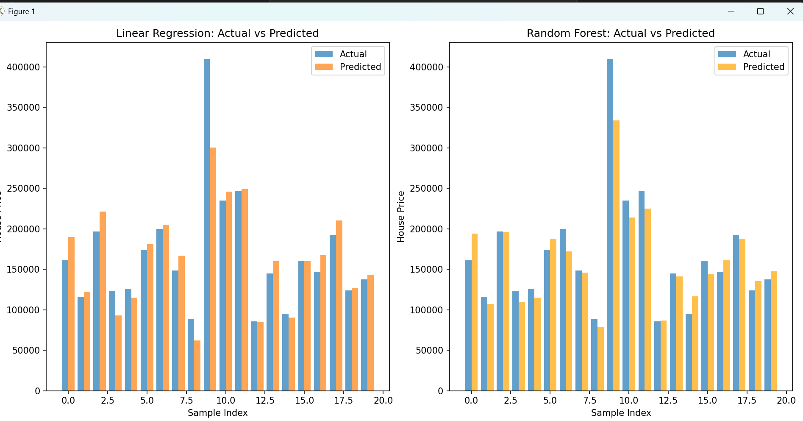

# House Price Prediction

This project predicts house prices using Linear Regression and Random Forest models. The dataset used is **AmesHousing.csv**, and the results are visualized with clear bar charts.

## Features
- **Models**: Linear Regression and Random Forest
- **Evaluation Metrics**: 
  - Mean Squared Error (MSE)
  - R² Score
- **Visualization**: Actual vs Predicted prices using bar charts.

## Results
Here’s an example chart comparing actual and predicted prices:



## How to Run
1. Clone the repository:
   ```bash
   git clone https://github.com/rosltahel/house-price-prediction.git
